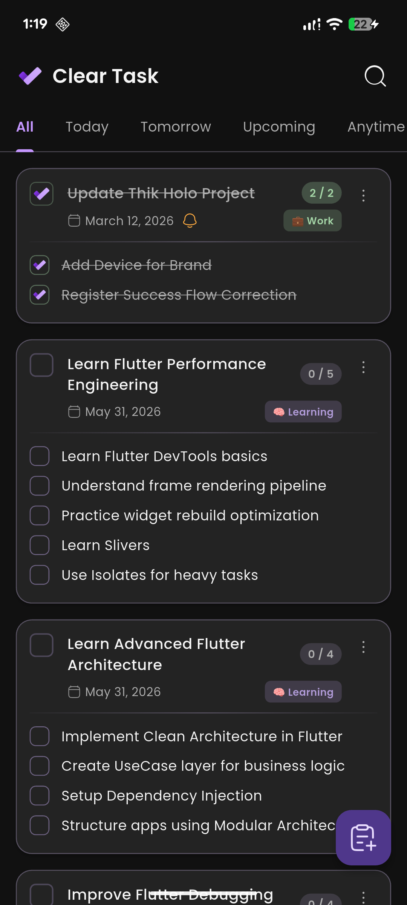
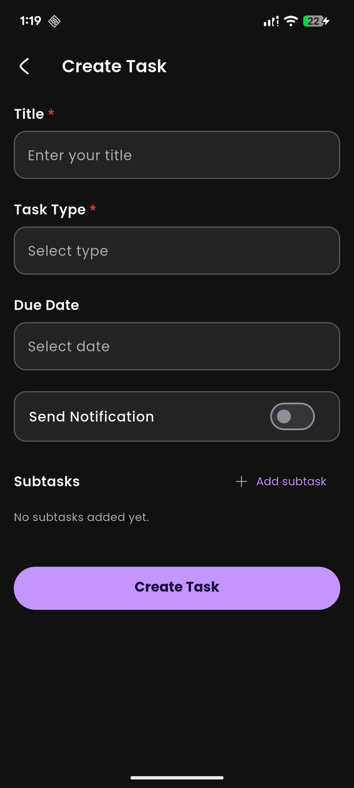
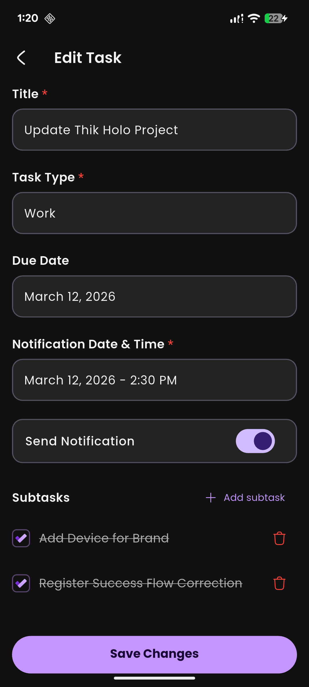
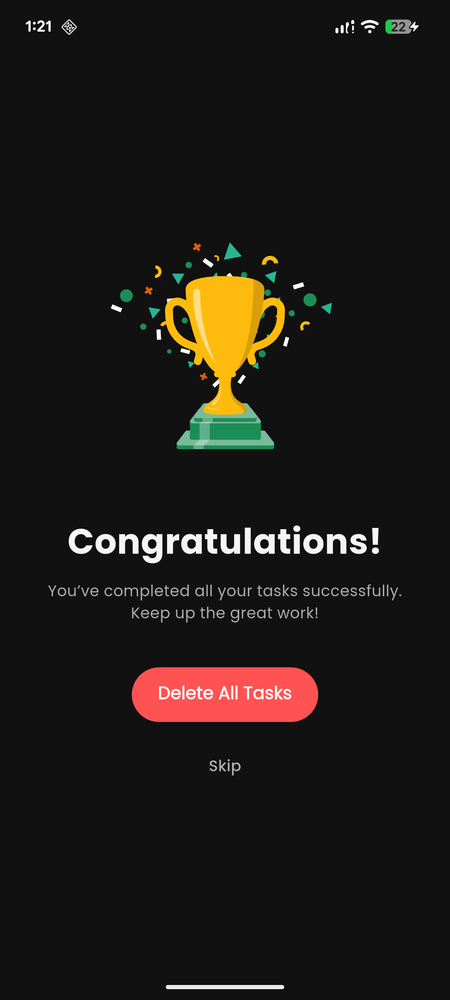

# 💩 ClearTask - Intelligent To-Do List App

ClearTask is a stunning, clean, and powerful task management application built with **Flutter**, designed to help you organize your daily life with ease. It features advanced **BLoC** architecture for predictable state management, **GetX** for seamless routing and snackbars, and a robust **SQLite** local database to keep your data secure and offline-ready.

---

## 🚀 Key Features

* ✅ **Create, Update, Delete Tasks**: Organize your thoughts instantly.
* 🌿 **Subtask Management**: Break down complex parent tasks into manageable subtasks. The parent task automatically completes when all subtasks are finished!
* 🗕 **Smart Date Categorizations**: Automatically filters tasks by Due Date (Today, Tomorrow, Upcoming, Anytime).
* 🏷 **Task Types**: Categorize your tasks intuitively (e.g., Home, Office, Study).
* 🔔 **Scheduled Notifications**: Never miss a beat with reliable local reminders. Notifications smart-update when task times change.
* 🎉 **Celebration View**: Get a fun full-screen celebration when all your active tasks are completed!
* 🧽 **Sleek Navigation**: Effortless tab layouts, quick-access floating action buttons, and an intuitive drawer side-menu.
* 📊 **Completed Tasks History**: Review your productivity at a glance.
* 🔍 **Smart Search**: Quickly find tasks with real-time text filtering.

---

## 📱 User Interface

### Dynamic Tabs
* **All** - Complete overview
* **Today** - Urgent tasks
* **Tomorrow** - Short-term planning
* **Upcoming** - Future goals
* **Anytime** - Tasks with no specific due date
* **Completed** - Your hall of fame

---

## 🧱 Technical Architecture & Stack

ClearTask follows **Clean Architecture** principles to separate concerns and ensure maintainability. 

### Core Stack:
| Technology | Purpose |
| ---------- | ------- |
| **Flutter**  | Cross-platform UI Toolkit |
| **BLoC**     | Advanced State Management & Event Handling |
| **GetX**     | Dynamic Routing, Overlays, and Snackbars |
| **SQLite (sqflite)** | Robust Local Database |
| **flutter_local_notifications** | Reliable Device-level Scheduling |
| **Google Fonts** | Modern Typography (Poppins) |
| **HugeIcons/Cupertino** | Premium aesthetic iconography |

### Module Structure:
```
lib/
│
├── core/             # Constants, App Theme, Enums, formatters, and global widgets
├── data/             # Models (Task, Subtask), SQLite Database Helpers, and Repositories
├── presentation/     # Views, Screens, BLoCs, Cubits, and Reusable UI Components
└── main.dart         # Initialization and App Entry
```

---

## 📸 Screenshots

Here is a glimpse of the beautiful app in action!

| Home Screen | Task Creation |
| ----------- | ------------- |
|  |  |

| Edit Tasks                                | Completing Tasks |
|-------------------------------------------| ---------------- |
|  |  |

---

## 🥪 Future Roadmap

* 🔄 **Firebase Cloud Syncing**: Access your tasks across devices
* 👤 **User Authentication**: Secure sign-up and login flows
* 📊 **Analytics Dashboard**: Weekly productivity charts
* 🌙 **Dynamic Theme Adjustments**: Enhanced dark mode customization
* 🧠 **AI Task Suggestions**: Intelligent prioritization based on your habits

---

## 🧑‍💻 Author

**Nadim Chowdhury**

* 🧠 Passionate Flutter Developer
* 🎓 BSc in CSE, Port City International University
* 🔗 [LinkedIn](https://www.linkedin.com/in/devnadimm/)
* 📬 [nadimm.dev@gmail.com](mailto:nadimchowdhury87@gmail.com)
* 💻 [GitHub](https://github.com/DevNadimm)
